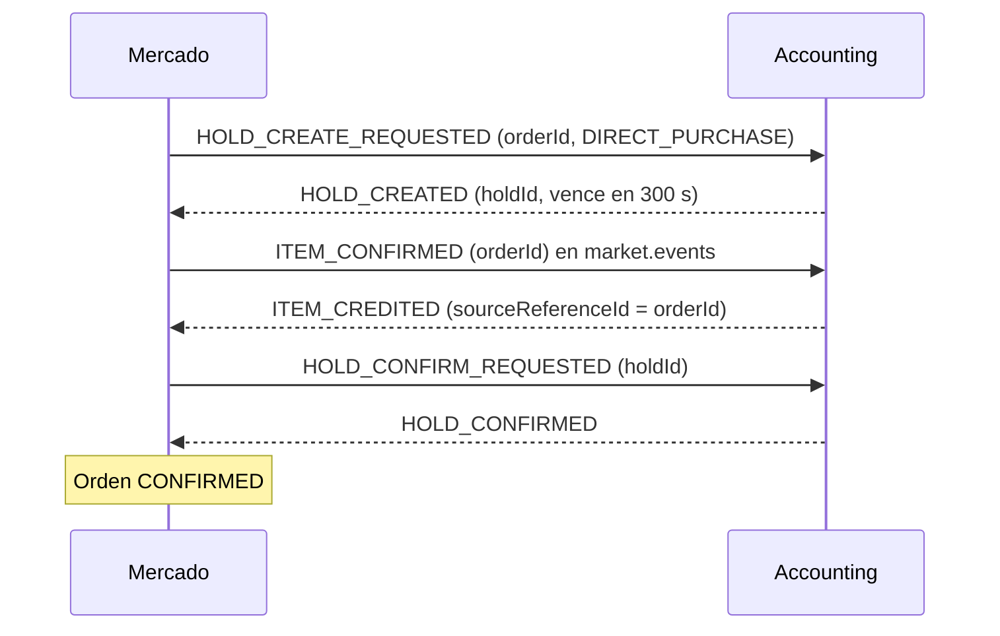

# Propuesta C de la saga de compra

> Propuesta para cerrar [[Q-008 - Orden de la saga de compra]]: retener las monedas, acreditar el ítem y recién después confirmar el débito. Nunca se cobra sin entregar y se usan los mensajes que Accounting ya tiene; a Accounting solo se le piden eventos nuevos. Es un borrador para presentar al equipo, no una decisión.

## Contexto
La compra directa necesita coordinar dos pasos en Accounting: confirmar el débito del [[Hold de monedas]] y acreditar el ítem en el inventario. Hay tres órdenes posibles (A, B y C, ver [[Q-008 - Orden de la saga de compra]]). Esta nota desarrolla el orden C, recomendado por el [[Taller de decisiones]] (D2 y D9), como insumo de [[S2-09b - SPIKE Orden de la compra con Accounting]].

**Alcance:** compra directa de ítems. La compra de vidas no cambia: sigue con `HOLD_CONFIRMED` y luego `LIFE_PURCHASE_CONFIRMED` ([[S2-11 - Acuerdos de compra de vidas con Accounting]]).

## Flujo feliz

Todos los mensajes viajan por Kafka ([[DEC-003 - Holds solo por Kafka]]) y Mercado los publica con [[Patrón Outbox]].

## Fallos y compensaciones

| # | Qué falla | Momento | Qué hace Mercado | ¿Existe hoy? |
|---|---|---|---|---|
| 1 | `HOLD_REJECTED` | Antes de entregar | `REJECTED_INSUFFICIENT_FUNDS` y libera el stock | Sí |
| 2 | `HOLD_EXPIRED` antes de entregar | Antes de entregar | `EXPIRED` y libera el stock | Sí |
| 3 | Accounting no puede acreditar el ítem | Antes de cobrar | `CANCELLED`, `HOLD_RELEASE_REQUESTED` y libera el stock | No: hace falta `ITEM_CREDIT_FAILED` (hoy el fallo va a DLT sin evento) |
| 4 | `ITEM_CREDITED` no llega | Incierto | Consulta a Accounting y decide (ver abajo) | No: hace falta consultar el ítem por `orderId` |
| 5 | `HOLD_CONFIRM_REQUESTED` falla o el hold vence después de acreditar | Entregado sin cobrar | Pide revocar el ítem | No: hace falta `ITEM_REVOKE_REQUESTED` |

El caso 5 es el riesgo residual de esta opción y se presenta como tal.

### Caso 4 en detalle: la respuesta que no llega
Mercado envió `ITEM_CONFIRMED` y espera `ITEM_CREDITED`, pero no llega. El problema es que el mismo síntoma ("no llegó nada") corresponde a dos situaciones opuestas en Accounting:

| Qué pasó en Accounting | ¿El estudiante tiene el ítem? | Qué corresponde hacer |
|---|---|---|
| a) Acreditó, pero la respuesta se perdió o se demoró | Sí | Cobrar: `HOLD_CONFIRM_REQUESTED` |
| b) No acreditó (falló o terminó en DLT) | No | Devolver las monedas: `HOLD_RELEASE_REQUESTED` |

Si Mercado adivina, puede equivocarse en cualquiera de los dos sentidos:

- Supone b y era a: libera las monedas y el estudiante se queda con el ítem gratis.
- Supone a y era b: cobra sin entregar, justo lo que la propuesta quiere evitar.

Además, el tiempo corre: si Mercado espera sin límite, el hold vence solo (300 s) y, si era a, se termina en el caso 5.

**Solución: preguntar en lugar de adivinar.**

1. Mercado fija un plazo interno para recibir `ITEM_CREDITED` (por ejemplo, 120 s desde `ITEM_CONFIRMED`).
2. Si vence el plazo, consulta a Accounting si existe un ítem acreditado para esa `orderId`.
3. Si existe, cobra (`HOLD_CONFIRM_REQUESTED`). Si no existe, libera el hold y el stock.

Hoy esa consulta no es posible: las lecturas de ítems de Accounting son por estudiante (`GET /{studentId}/items`, solo ADMIN), y `GET /api/accounting/holds/{holdId}` informa el estado del hold, no si se entregó el ítem. Por eso se pide una consulta del ítem por `orderId`; `inventory_items` ya guarda `order_id` ([[Integración con Accounting]]).

Si Accounting publica `ITEM_CREDIT_FAILED` (caso 3), la situación b deja de ser silenciosa y el caso 4 queda reducido a mensajes realmente perdidos o demorados. Por eso `ITEM_CREDIT_FAILED` es el pedido principal y la consulta por `orderId` es la red de seguridad.

## Restricciones que condicionan la propuesta
- **Un hold por orden para siempre.** Accounting impone `UNIQUE(account_id, order_id)`. Si el hold vence después de acreditar, no se puede crear otro para la misma orden: la compensación del caso 5 es revocar el ítem, no reintentar el cobro.
- **Presupuesto de tiempo.** Acreditar y confirmar deben terminar dentro de los 300 s del TTL de `DIRECT_PURCHASE`. El plazo interno del caso 4 evita que el caso 5 se vuelva frecuente.

## Pedidos a Accounting
1. **`ITEM_CREDIT_FAILED`** (`sourceReferenceId`, `reason`) en lugar del fallo silencioso a DLT. Sin este evento la propuesta no es segura.
2. **`ITEM_REVOKE_REQUESTED`** por `orderId`, con respuestas `ITEM_REVOKED` e `ITEM_REVOKE_FAILED`. Hay que acordar qué pasa si el ítem ya está `EQUIPPED`, `RESERVED` o `CONSUMED`; se sugiere revocar solo si está `AVAILABLE` y, en otro caso, aceptar la pérdida y dejarla marcada para revisión de un ADMIN.
3. **Consulta del ítem por `orderId`**, para resolver el caso 4.
4. Deseable: `correlationId` en `ITEM_CREDITED`. Hoy se correlaciona por `sourceReferenceId`, que alcanza.

## Cambios en Mercado
- Reordenar la saga: `ITEM_CONFIRMED` después de `HOLD_CREATED` y `HOLD_CONFIRM_REQUESTED` después de `ITEM_CREDITED`. Desaparecen `ITEM_PROVISION_*`.
- `ITEM_CONFIRMED` debe llevar el `orderRef` UUID; hoy lleva el `id` numérico ([[Orden de compra]], [[Roadmap de trabajo]]).
- Encender `market.events.item-confirmed.enabled`.
- Mantener los nombres de los estados: `ITEM_PROVISION_REQUESTED` pasa a significar "esperando `ITEM_CREDITED`" e `ITEM_PROVISIONED`, "acreditado". En PostgreSQL el `CHECK` del enum de `status` no se amplía con `ddl-auto=update`, y un estado nuevo exige migración.
- Caso 5: repetir el patrón de `SETTLED_UNCREDITED` ([[Orden de compra]]): la orden queda `CANCELLED` con `HOLD_NOT_SETTLED` y una marca (por ejemplo, `CREDITED_UNSETTLED`) mientras se pide la revocación.
- Deduplicar `ITEM_CREDITED` por `sourceReferenceId`, porque no trae `correlationId` ([[Idempotencia]]).
- Plazo interno y reconciliación del caso 4, junto con la reconciliación de holds pendiente de [[S2-OPC1 - Reconciliación de compras]].

## Comparación con A y B

| | A. Código de Mercado | B. Código de Accounting | C. Esta propuesta |
|---|---|---|---|
| ¿Accounting conoce los mensajes? | No | Sí | Sí |
| ¿Puede cobrar sin entregar? | No | Sí, sin aviso | No |
| Riesgo residual | Entregar sin cobrar | Cobrar sin entregar | Entregar sin cobrar, solo si falla la confirmación |
| Qué pide a Accounting | Mensajes nuevos y revocación | Reembolso (no existe) | Eventos nuevos, sin cambiar los existentes |

Argumento principal: con monedas de juego, entregar un ítem por error es menos grave que cobrarle a un estudiante sin entregarle nada, y C es la única opción que no obliga a Accounting a cambiar lo que ya hace.

## Preguntas para la reunión con Accounting
1. ¿Pueden publicar `ITEM_CREDIT_FAILED` este sprint?
2. ¿Qué se hace con un ítem ya usado cuando corresponde revocarlo?
3. ¿Qué plazo interno se acuerda para `ITEM_CREDITED`?

## Alternativa a tener presente
Accounting es dueño del hold y del inventario ([[DEC-001 - Accounting es dueño del inventario]]), así que lo más robusto sería que acredite y cobre en una sola transacción local. Esa era la idea de `PURCHASE_SETTLEMENT_REQUESTED`, descartada porque ninguno de los dos lados la implementa ([[Ideas descartadas]]). Si Accounting no acepta la revocación, es el argumento para reabrirla.

## Relacionado
[[Saga]], [[Q-008 - Orden de la saga de compra]], [[S2-09b - SPIKE Orden de la compra con Accounting]], [[Integración con Accounting]], [[Orden de compra]].
