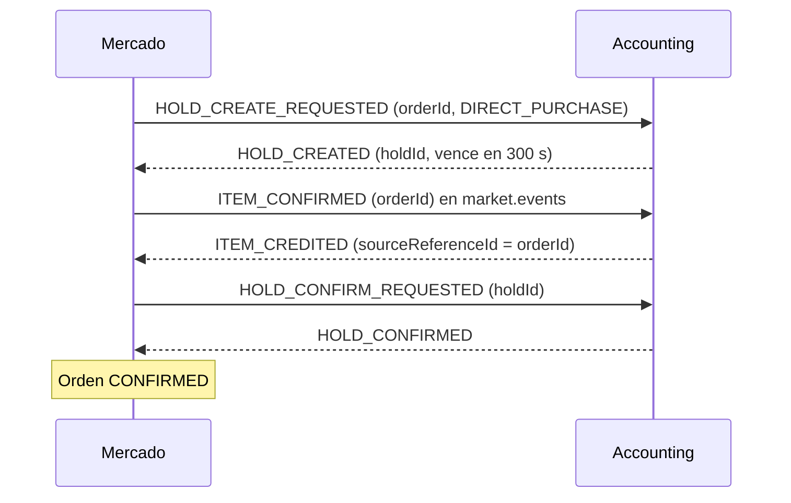
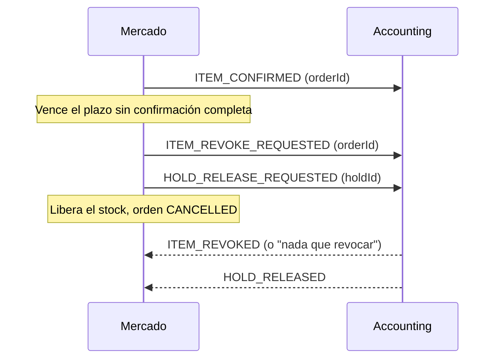

# Propuesta C de la saga de compra

> Propuesta para cerrar [[Q-008 - Orden de la saga de compra]]: retener las monedas, acreditar el ítem y recién después confirmar el débito; si la orden no se confirma dentro de un plazo, Mercado deshace todo (ítem, monedas y stock). Nunca se cobra sin entregar y a Accounting solo se le piden dos eventos nuevos. Es un borrador para presentar al equipo, no una decisión.

## Contexto
La compra directa necesita coordinar dos pasos en Accounting: confirmar el débito del [[Hold de monedas]] y acreditar el ítem en el inventario. Hay tres órdenes posibles (A, B y C, ver [[Q-008 - Orden de la saga de compra]]). Esta nota desarrolla el orden C, recomendado por el [[Taller de decisiones]] (D2 y D9), como insumo de [[S2-09b - SPIKE Orden de la compra con Accounting]].

La propuesta tiene dos partes independientes:

| Parte | Pregunta que responde | Qué propone |
|---|---|---|
| **Orden** | ¿Qué va primero, acreditar o cobrar? | Acreditar el ítem y después confirmar el débito (C) |
| **Compensación** | ¿Cómo se deshace cuando algo falla? | Rollback completo por plazo: revocar el ítem, liberar las monedas y liberar el stock |

**Alcance:** compra directa de ítems. La compra de vidas no cambia: sigue con `HOLD_CONFIRMED` y luego `LIFE_PURCHASE_CONFIRMED` ([[S2-11 - Acuerdos de compra de vidas con Accounting]]).

## Estado actual de la saga
La saga ya existe en Mercado: máquina de estados de la [[Orden de compra]], envío con [[Patrón Outbox]], deduplicación de respuestas y compensaciones para hold rechazado, hold vencido y fallo al proveer el ítem. Corre completa con el transporte `mock`. Contra Accounting real no cierra: usa el orden A con `ITEM_PROVISION_*`, mensajes que Accounting no conoce, y faltan compensaciones (reconciliación apagada, órdenes trabadas en `CREATED`, sin revocación de ítems; ver [[Estado actual del código]]). Esta propuesta define cómo terminarla, no cómo empezarla.

## Flujo feliz

Todos los mensajes viajan por Kafka ([[DEC-003 - Holds solo por Kafka]]) y Mercado los publica con [[Patrón Outbox]].

## Rollback completo por plazo
Mercado calcula un plazo a partir del vencimiento del hold que informa Accounting:

> plazo = `holdExpiresAt` − margen (por ejemplo, 60 s)

Así el plazo se apoya en el mismo TTL y se ajusta solo si Accounting cambia los 300 s. Lo único que hay que acordar es el margen. Ese único momento cumple dos funciones:

1. **Corte para confirmar.** Si `ITEM_CREDITED` llega antes del plazo, Mercado envía `HOLD_CONFIRM_REQUESTED`; si llega después, no confirma y deshace. Así cada confirmación sale con al menos el margen de tiempo para llegar antes de que venza el hold.
2. **Disparador del rollback.** Si `ITEM_CREDITED` no llega nunca (caso 4), el plazo le indica a Mercado que deje de esperar, sin depender de que llegue `HOLD_EXPIRED`.

Al vencer el plazo sin confirmación completa, Mercado deshace la compra en los tres lugares donde dejó efectos:

| Qué se deshace     | Dónde vive                               | Cómo                                                |
| ------------------ | ---------------------------------------- | --------------------------------------------------- |
| Ítem acreditado    | Inventario del estudiante, en Accounting | `ITEM_REVOKE_REQUESTED` por `orderId`               |
| Monedas retenidas  | Hold, en Accounting                      | `HOLD_RELEASE_REQUESTED` (o el vencimiento del TTL) |
| Stock de la oferta | Mercado (`stockReservationId`)           | Mercado lo libera                                   |

La orden pasa a `CANCELLED` y cualquier `ITEM_CREDITED` o `HOLD_CONFIRMED` que llegue después se ignora, porque la orden ya está en un estado terminal.

**Por qué no alcanza con esperar al TTL.** El vencimiento del hold solo deshace las monedas: si el ítem ya se acreditó, el estudiante se queda con él gratis. Además, apuntar justo al segundo 300 es apuntar a un borde que cada servicio ve en un momento distinto: el TTL lo cuenta Accounting con su reloj, Mercado se entera con la latencia de `HOLD_CREATED`, y hoy convierte `expiresAt` con la zona del sistema en lugar de UTC ([[S2-05 - Robustez de la compra]]). Por último, Accounting discute en su documento si el planificador de `HOLD_EXPIRED` existe.

**El plazo previene; el rollback garantiza.** El margen no asegura que la confirmación llegue a tiempo: si Kafka o Accounting la demoran más que el margen, Accounting la rechaza porque el hold ya venció. Ese es el caso 5, y Mercado responde con el mismo rollback completo. El plazo hace que esa situación sea rara, y el rollback cubre la que igual ocurra. Sin plazo, cualquier Accounting algo lento haría que se revoquen ítems con frecuencia.

| Pieza | Rol |
|---|---|
| Plazo (`holdExpiresAt` − margen) | Prevención: la confirmación tardía es rara |
| Rollback completo | Garantía: si igual ocurre, se deshace todo |

**Tradeoff del margen.** Muy chico: vuelve el riesgo de confirmar tarde. Muy grande: se cancelan compras que habrían salido bien con un Accounting algo lento.

**Condiciones para que sea seguro:**

1. **Revocación idempotente.** Revocar una orden sin ítem acreditado responde "nada que revocar", no un error.
2. **Bloqueo de acreditaciones tardías.** Si `ITEM_CONFIRMED` quedó demorado en Kafka y Accounting lo procesa después de la revocación, no debe acreditar. Dos formas: Accounting recuerda las `orderId` revocadas, o solo acredita si el hold de esa orden sigue `ACTIVE` (la más robusta, porque Accounting es dueño de los dos).
3. **Ítem ya usado.** Si dentro de la ventana el estudiante equipó o consumió el ítem (`EQUIPPED`, `RESERVED`, `CONSUMED`), se revoca solo si está `AVAILABLE`; en otro caso se acepta la pérdida y queda marcado para revisión de un ADMIN.

Esta compensación no es exclusiva de C: sirve para cualquier orden que entregue antes de cobrar, incluido A.

## Fallos y compensaciones

| # | Qué falla | Momento | Qué hace Mercado | ¿Existe hoy? |
|---|---|---|---|---|
| 1 | `HOLD_REJECTED` | Antes de entregar | `REJECTED_INSUFFICIENT_FUNDS` y libera el stock | Sí |
| 2 | `HOLD_EXPIRED` antes de entregar | Antes de entregar | `EXPIRED` y libera el stock | Sí |
| 3 | Accounting no puede acreditar el ítem | Antes de cobrar | `CANCELLED`, `HOLD_RELEASE_REQUESTED` y libera el stock | No: hace falta `ITEM_CREDIT_FAILED` (hoy el fallo va a DLT sin evento) |
| 4 | `ITEM_CREDITED` no llega | Incierto | Rollback completo por plazo | No: hace falta `ITEM_REVOKE_REQUESTED` |
| 5 | `HOLD_CONFIRM_REQUESTED` falla o el hold vence después de acreditar | Entregado sin cobrar | Rollback completo por plazo | No: hace falta `ITEM_REVOKE_REQUESTED` |

### Caso 4 en detalle: la respuesta que no llega
Mercado envió `ITEM_CONFIRMED` y espera `ITEM_CREDITED`, pero no llega. El mismo síntoma ("no llegó nada") corresponde a dos situaciones opuestas en Accounting:

| Qué pasó en Accounting | ¿El estudiante tiene el ítem? |
|---|---|
| a) Acreditó, pero la respuesta se perdió o se demoró | Sí |
| b) No acreditó (falló o terminó en DLT) | No |

Mercado no puede distinguirlas, y cualquier decisión basada en adivinar falla en uno de los dos casos:

- **Esperar al TTL:** devuelve las monedas en los dos casos. En a, el estudiante se queda con el ítem gratis.
- **Confirmar el débito:** en b, cobra sin entregar, justo lo que la propuesta quiere evitar.

El rollback completo por plazo **no necesita saber cuál de las dos pasó**: deshace todo y el resultado es correcto en ambas.

| Qué pasó | Efecto de la revocación | Resultado |
|---|---|---|
| a) Acreditó | Quita el ítem | Sin ítem y sin cobro |
| b) No acreditó | Nada que revocar | Sin ítem y sin cobro |

El estudiante ve la compra cancelada y puede volver a intentarla con una orden nueva. Si Accounting publica `ITEM_CREDIT_FAILED` (caso 3), la situación b deja de ser silenciosa y el caso 4 queda reducido a mensajes realmente perdidos o demorados.

**Alternativa descartada en esta propuesta:** consultar a Accounting si existe un ítem acreditado para la `orderId` y decidir según la respuesta. Funciona, pero exige un endpoint nuevo y lógica de reconciliación; el rollback completo da el mismo resultado seguro con un pedido menos.

## Restricciones que condicionan la propuesta
- **Un hold por orden para siempre.** Accounting impone `UNIQUE(account_id, order_id)`. Si el hold vence después de acreditar, no se puede crear otro para la misma orden: la compensación es deshacer, no reintentar el cobro.
- **Presupuesto de tiempo.** Acreditar y confirmar deben terminar dentro de los 300 s del TTL de `DIRECT_PURCHASE`. Por eso el plazo de Mercado se define como `holdExpiresAt` menos un margen.

## Pedidos a Accounting
1. **`ITEM_CREDIT_FAILED`** (`sourceReferenceId`, `reason`) en lugar del fallo silencioso a DLT.
2. **`ITEM_REVOKE_REQUESTED`** por `orderId`, con respuestas `ITEM_REVOKED` e `ITEM_REVOKE_FAILED`, idempotente y que bloquee las acreditaciones tardías de esa orden.
3. Deseable: `correlationId` en `ITEM_CREDITED`. Hoy se correlaciona por `sourceReferenceId`, que alcanza.

## Cambios en Mercado
- Reordenar la saga: `ITEM_CONFIRMED` después de `HOLD_CREATED` y `HOLD_CONFIRM_REQUESTED` después de `ITEM_CREDITED`. Desaparecen `ITEM_PROVISION_*`.
- `ITEM_CONFIRMED` debe llevar el `orderRef` UUID; hoy lleva el `id` numérico ([[Orden de compra]], [[Roadmap de trabajo]]).
- Encender `market.events.item-confirmed.enabled`.
- Mantener los nombres de los estados: `ITEM_PROVISION_REQUESTED` pasa a significar "esperando `ITEM_CREDITED`" e `ITEM_PROVISIONED`, "acreditado". En PostgreSQL el `CHECK` del enum de `status` no se amplía con `ddl-auto=update`, y un estado nuevo exige migración.
- Plazo de confirmación (`holdExpiresAt` − margen, con `holdExpiresAt` guardado en UTC) y rollback completo al vencer: `ITEM_REVOKE_REQUESTED`, `HOLD_RELEASE_REQUESTED`, liberar el stock y `CANCELLED`. El mismo rollback responde a un `HOLD_CONFIRM_REQUESTED` rechazado.
- Ignorar `ITEM_CREDITED` y `HOLD_CONFIRMED` tardíos en órdenes terminadas, y deduplicar `ITEM_CREDITED` por `sourceReferenceId`, porque no trae `correlationId` ([[Idempotencia]]).

## Comparación con A y B

| | A. Código de Mercado | B. Código de Accounting | C. Esta propuesta |
|---|---|---|---|
| ¿Accounting conoce los mensajes? | No | Sí | Sí |
| ¿Puede cobrar sin entregar? | No | Sí, sin aviso | No |
| Riesgo residual | Entregar sin cobrar | Cobrar sin entregar | Ítem ya usado al revocar (raro: ventana de segundos) |
| Qué pide a Accounting | Mensajes nuevos y revocación | Reembolso (no existe) | Dos eventos nuevos, sin cambiar los existentes |

Argumento principal: C es la única opción que no cobra sin entregar y no obliga a Accounting a cambiar lo que ya hace; el rollback completo por plazo cierra el riesgo de entregar sin cobrar.

## Preguntas para la reunión con Accounting
1. ¿Pueden publicar `ITEM_CREDIT_FAILED` e `ITEM_REVOKE_REQUESTED` este sprint?
2. ¿Cómo bloquean una acreditación tardía después de revocar: recordando la `orderId` o exigiendo el hold `ACTIVE`?
3. ¿Qué se hace con un ítem ya usado cuando corresponde revocarlo?
4. ¿Qué margen se acuerda antes del vencimiento del hold para dejar de confirmar?

## Alternativa a tener presente
Accounting es dueño del hold y del inventario ([[DEC-001 - Accounting es dueño del inventario]]), así que lo más robusto sería que acredite y cobre en una sola transacción local. Esa era la idea de `PURCHASE_SETTLEMENT_REQUESTED`, descartada porque ninguno de los dos lados la implementa ([[Ideas descartadas]]). Si Accounting no acepta la revocación, es el argumento para reabrirla.

## Relacionado
[[Saga]], [[Q-008 - Orden de la saga de compra]], [[S2-09b - SPIKE Orden de la compra con Accounting]], [[Integración con Accounting]], [[Orden de compra]].
