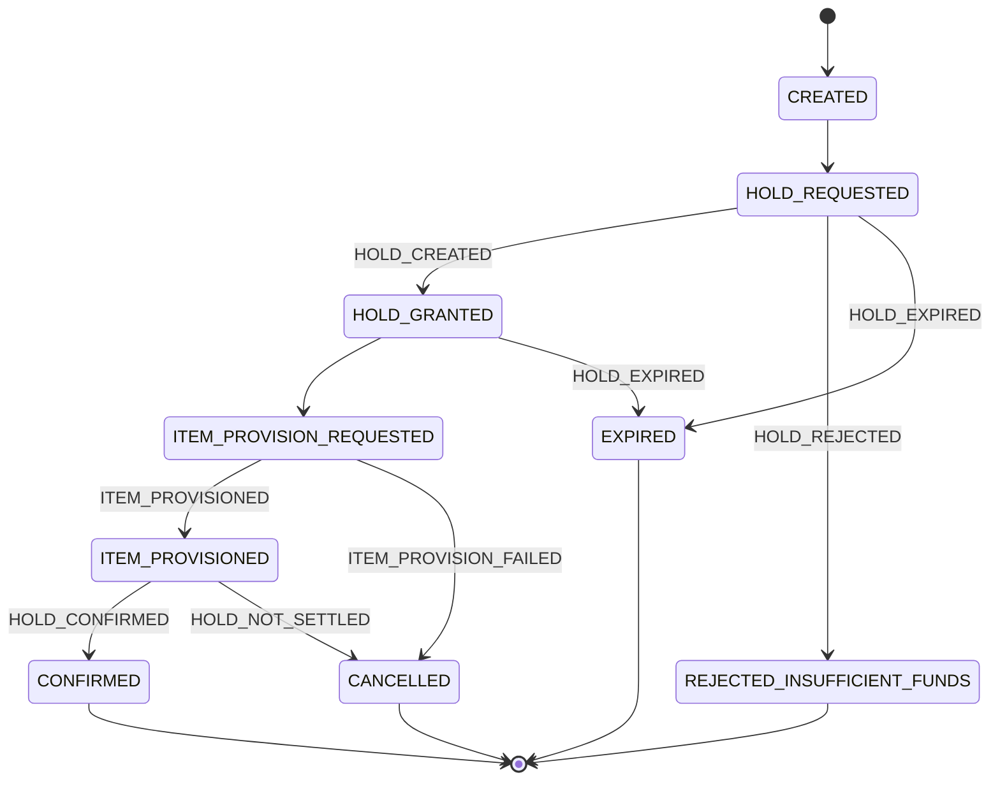

# Orden de compra

> Registro de un intento de compra de un estudiante. Avanza por una máquina de estados que refleja la [[Saga]] con Accounting (ex Banco) y, hoy, evita confirmar el débito antes de entregar el item. Ese orden está en discusión: [[Q-008 - Orden de la saga de compra]].

## Qué representa
Una compra en curso o terminada: quién compró, qué oferta, a qué precio y cómo terminó. El cliente la ve como `PROCESSING` hasta que concluye.

## Datos principales
| Campo | Significado |
|---|---|
| `orderRef` | UUID canónico de la orden (columna `order_ref`, restricción única `uk_orders_order_ref`, `updatable = false`). Lo asigna `PurchaseOrderServiceImpl` al crearla; si falta, `@PrePersist` y `requestHold` lo generan. Es el `orderId` que Mercado envía a Accounting; el `id` numérico sigue siendo el que ve el cliente HTTP |
| `courseId`, `studentId`, `offerId` | Contexto de la compra |
| `itemType` | Tipo de ítem copiado de la oferta al crear la orden; evita leer la oferta al confirmar. Nulo en órdenes anteriores al PR #82 (ver [[Estado actual del código]]) |
| `appliedPrice` | Precio congelado al comprar |
| `status` | Estado actual (`OrderStatus`) |
| `holdId`, `holdExpiresAt` | Hold de Accounting y su vencimiento ([[Hold de monedas]]) |
| `stockReservationId` | Reserva de stock |
| `cancellationReason` | `ITEM_PROVISION_FAILED` o `HOLD_NOT_SETTLED` |
| `idempotencyKey`, `requestFingerprint` | Evitan cobros duplicados ([[Idempotencia]]) |
| `version` | Control de concurrencia ([[Bloqueo optimista]]) |

## Ciclo de vida / estados

`PROCESSING` es solo el nombre HTTP de `CREATED`; nunca se persiste. Estados terminales: `CONFIRMED`, `REJECTED_INSUFFICIENT_FUNDS`, `CANCELLED`, `EXPIRED`. Esta máquina es la oficial ([[DEC-004 - Máquina de estados de la orden según el código]]); las cinco variantes de los documentos anteriores están en [[Q-005 - Estados de la orden]] (archivada).

## Reglas de negocio
- Hoy el código no confirma el débito antes de provisionar el item. Accounting hace lo contrario y el taller recomienda un tercer orden: ver [[Q-008 - Orden de la saga de compra]] (la máquina de estados cambiaría).
- **Cobrada sin acreditar (`SETTLED_UNCREDITED`)**: si Accounting responde a `LIFE_PURCHASE_CONFIRMED` con `LIFE_PURCHASE_REJECTED` (`ACCOUNT_NOT_FOUND` o `ACCOUNT_INACTIVE`), la orden sigue en `CONFIRMED` (el débito existió) y se marca con `settlement_mark = SETTLED_UNCREDITED` y `uncredited_reason`. No es un estado nuevo: en PostgreSQL el `CHECK` del enum de `status` no se amplía con `ddl-auto=update`. El frame SSE la muestra como `SETTLED_UNCREDITED` y el detalle explica que un administrador revisará la devolución, que se pide desde BackOffice (`COIN_LEDGER_REVERSAL_REQUESTED`) ([[S2-11 - Acuerdos de compra de vidas con Accounting]]).
- **Flujo de compra de vidas vs. ítems**: En la máquina de estados actual, el estado que precede a `CONFIRMED` es siempre `ITEM_PROVISIONED` (el cual dispara la confirmación del hold). Al confirmarse el hold (`HOLD_CONFIRMED`), la orden pasa a `CONFIRMED`. En ese momento, si la compra es de vidas (`ItemType.LIFE`), se publica `LIFE_PURCHASE_CONFIRMED` en `market.events` y **no se emite** `ITEM_CONFIRMED` (CA5 de [[S2-10 - Compra de vidas con LIFE_PURCHASE_CONFIRMED]]). Para otros ítems se emite `ITEM_CONFIRMED` si está habilitado. *No debe confundirse el evento saliente `ITEM_CONFIRMED` con el estado interno `ITEM_PROVISIONED`.*
- Ante fallo de provisión: `CANCELLED`, se libera stock y se pide `HOLD_RELEASE_REQUESTED`. Un fallo que accounting nunca informa (va a DLT sin evento) dejaría la orden esperando.
- Ante hold vencido: `EXPIRED` y se libera stock. Accounting fija el TTL en 300 s para compras directas.
- Si Accounting rechaza la confirmación con `INVALID_HOLD_STATE`, `reconcileHoldStatus` consulta el estado: `COMMITTED` confirma, `RELEASED` cancela con `HOLD_NOT_SETTLED` (hoy la consulta es simulada, el job está apagado y accounting no tiene la consulta). Esa cancelación además no libera el stock (gap 19 de [[Estado actual del código]], sin verificar).
- Accounting exige un `orderId` UUID canónico y un hold por `orderId` para siempre. Decidido: Mercado genera y persiste un `orderRef` UUID y lo usa como `orderId` ([[DEC-009 - Contrato de holds e ítems según Accounting]]). Implementado en `develop` (PR #88, US-5193): `OrderEntity.bankOrderId()` devuelve el `orderRef` como texto (y, solo en una fila sin `orderRef`, el `id` numérico), `OrderHoldServiceImpl.requestHold` lo envía en `HOLD_CREATE_REQUESTED` y `OrderConfirmationServiceImpl.reconcileHoldStatus` lo compara con el `orderId` que devuelve la consulta del hold (si no coincide, registra el error y no reconcilia). Desde US-6268 (`tpi-market` #95, verificado contra `74e671ef`) `LIFE_PURCHASE_CONFIRMED` lleva el mismo `orderRef` que el hold, con como máximo 36 caracteres ([[S2-11 - Acuerdos de compra de vidas con Accounting]]), y `OrderRepository.findByOrderRef` lo usa `LifePurchaseRejectionServiceImpl` para resolver `LIFE_PURCHASE_REJECTED`. `PURCHASE_CONFIRMED` e `ITEM_CONFIRMED` siguen llevando el `id` numérico (`dtos/events/*PayloadDto.java`). Ver [[Integración con Accounting]].
- El estudiante solo ve sus propias órdenes; las ajenas responden 404.
- Rechazos posibles (`OrderRejectionReason`): `INSUFFICIENT_FUNDS` (viaja como `INSUFFICIENT_BALANCE`; cualquier otro motivo de accounting cae igualmente en `REJECTED_INSUFFICIENT_FUNDS`, ver [[Estado actual del código]], gap 22), `PROVISION_FAILED`, y `LIFE_CAP_REACHED`. Desde la enmienda del 2026-10-04 Mercado valida el tope de vidas antes de vender: si la oferta otorga más vidas que `max(0, maxLives − (currentLives + livesInFlight))` (`livesInFlight`: vidas de las órdenes de vidas propias todavía en vuelo), responde 422 `LIFE_CAP_REACHED` sin crear la orden ni el hold; si pasa, emite `LIFE_PURCHASE_CONFIRMED` tras `HOLD_CONFIRMED` y Accounting acredita hasta su tope ([[DEC-007 - Tope de vidas, Accounting decide y reporta]], [[S2-11 - Acuerdos de compra de vidas con Accounting]]); y todos los motivos de rechazo de accounting deben mapearse ([[DEC-009 - Contrato de holds e ítems según Accounting]]).

## Dónde vive en el código
`models/enums/OrderStatus.java` (tabla de transiciones), `entities/OrderEntity.java` (`transitionTo`, `cancel`, `bankOrderId`), `services/impl/PurchaseOrderServiceImpl.java`, `OrderHoldServiceImpl.java`, `OrderItemProvisionServiceImpl.java`, `OrderConfirmationServiceImpl.java`, `BankHoldReconciliationServiceImpl.java`, `listeners/AccountingHoldEventHandler.java`, `InventoryItemEventHandler.java`.

## Relacionado
[[Épica 137 - Compra directa]], [[Eventos y Kafka]], [[SSE]], [[Integración con Accounting]].
