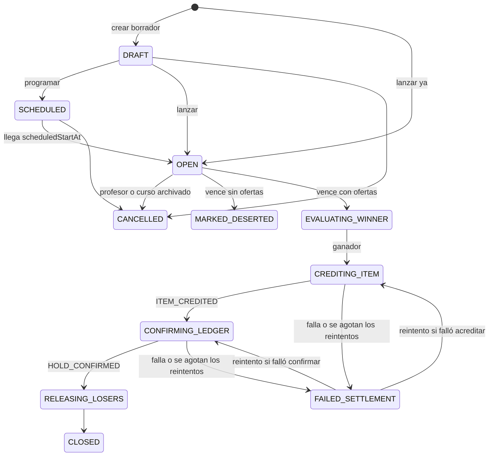
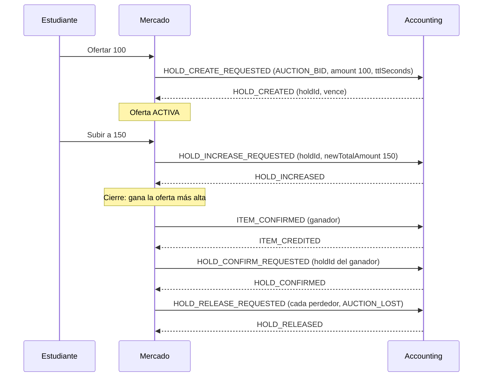

# Subasta

> Intención del dominio: subastas de items entre estudiantes de un curso. Es de la Fase 3 y no existe código. Las secciones anteriores a "Diseño técnico" recogen lo decidido y la documentación anterior; el diseño técnico es un borrador del spike [[S2-09c - SPIKE Diseño técnico de subastas]], sin confirmar por el equipo.

## Qué representa
Una venta con ofertas, con duración de una hora a catorce días y una base fijada por el profesor. Hay dos modos: **puja visible** (se ve la mejor oferta) y **ciega** (nadie ve las ofertas de los demás). La subasta de puja visible termina con una **fase final ciega** durante sus últimos X minutos, duración configurable por subasta por el profesor que la lanza (anti-sniping, [[DEC-014 - Reglas de subastas]]).

## Datos principales
| Campo | Significado |
|---|---|
| Modo | Puja visible o ciega ([[DEC-014 - Reglas de subastas]]) |
| Duración | 1 hora a 14 días ([[DEC-014 - Reglas de subastas]]) |
| Duración de la fase final (X) | Configurable por subasta, la define el profesor ([[DEC-014 - Reglas de subastas]]) |
| Ítem subastado | Una unidad de una oferta de catálogo, con snapshot al lanzar ([[DEC-016 - Subastas con ítems del catálogo mientras no existan ítems únicos]]) |
| Base | Oferta mínima que fija el profesor; opcional (sin valor, la base es 0) |
| Incremento mínimo | Opcional, configurable por subasta; solo en puja visible |
| Versión | Bloqueo optimista ([[Bloqueo optimista]]) |

## Ciclo de vida / estados
`DRAFT`, `SCHEDULED`, `OPEN` (`NO_BIDS` o `ACTIVE_BIDS`), luego `CANCELLED` o cierre en curso (`EVALUATING_WINNER`, `CREDITING_ITEM`, `CONFIRMING_LEDGER`, `RELEASING_LOSERS` o `MARKED_DESERTED`) hasta `CLOSED` o `FAILED_SETTLEMENT` (con reintento). Las ofertas pasan por `ACTIVA`, `SUPERADA`, `GANADORA` y `LIBERADA`.

Impacto de [[DEC-014 - Reglas de subastas]] en los estados (previsto, sin código):
- **Fase final ciega** (2026-10-01): en los últimos X minutos las ofertas pasan a ser ciegas (se puede ofertar sin ver las de los demás), el tiempo no se extiende y al cierre gana la más alta; el empate lo resolvía el dado según DEC-014 (el spike propone la oferta más antigua, ver "Desempate"). X es configurable por subasta; estaba **pendiente de detalle** la regla de la oferta ciega (el spike propone una, ver "Diseño técnico").
- **Modo ciega**: no hay mejor oferta visible; al vencer el tiempo, `EVALUATING_WINNER` compara las ofertas ciegas.
- **Desempate**: [[DEC-014 - Reglas de subastas]] decidió un dado tirado por el servidor, auditable. El spike propone reemplazarlo por la oferta más antigua con ese monto (ver "Desempate" en "Diseño técnico"); hasta que el equipo lo confirme, la decisión vigente sigue siendo el dado. La nota está en disputa por este punto: ver [[Q-025 - Desempate de las subastas]].
- **Superadas**: las ofertas `SUPERADA` conservan su hold hasta el cierre; se liberan todas juntas en `RELEASING_LOSERS` (con un release por postor).
- **Cancelación**: `CANCELLED` por profesor o por curso archivado libera un hold por postor.
- **Baja de un estudiante**: sus ofertas pasan a `LIBERADA` y la subasta sigue abierta.

## Reglas de negocio
Decidido ([[DEC-011 - Subastas, ítems únicos, cierre por profesor o por tiempo]] y [[DEC-014 - Reglas de subastas]]):
- La subasta termina cuando vence su tiempo o cuando un profesor la cancela; los estudiantes no pueden cancelar.
- **Qué se subasta** ([[DEC-016 - Subastas con ítems del catálogo mientras no existan ítems únicos]]): mientras no existan ítems únicos, una unidad de una oferta de catálogo basada en plantilla, con snapshot al lanzar; el motor no depende del tipo de ítem. "Ítem único" es una propuesta no aprobada ([[Ítems únicos]], [[DEC-011 - Subastas, ítems únicos, cierre por profesor o por tiempo]] enmendada).
- Cancelación: un `HOLD_RELEASE_REQUESTED` por postor. Los superados recuperan sus monedas al cierre.
- Incremento mínimo configurable por subasta; duración máxima de 14 días.
- En una subasta de puja visible, una oferta debe superar estrictamente a la mejor (sin empates). En subasta ciega el empate se resuelve con un dado decidido por el servidor según DEC-014; el spike propone la oferta más antigua en su lugar (ver "Desempate").
- Curso archivado: se cancelan las subastas abiertas. Baja de un estudiante: se retiran sus ofertas y la subasta continúa.
- El tiempo no se extiende; el anti-sniping es la fase final ciega descrita arriba.

Pendiente: la regla de la oferta en la fase final ciega (el spike propone una, ver "Diseño técnico"). [[Q-017 - Qué se subasta mientras no existan ítems únicos]] y [[Q-012 - Alcance de subastas]] están archivadas.

Garantía elegida (decisión previa del equipo, sin `DEC` propia): cada oferta retiene el monto completo en Accounting ([[Hold de monedas]]). La alternativa de retener solo al líder fue rechazada ([[Ideas descartadas]]). Recomendaciones del [[Taller de decisiones]]: S1, S3, S5 y S6 confirmadas, S10 reemplazada.

Lo que ya soporta Accounting: `orderType` `AUCTION_BID`, `HOLD_INCREASE_REQUESTED` y release con `AUCTION_LOST` o `AUCTION_CANCELLED`, con `ttlSeconds` obligatorio. Sin liberación en lote y con un hold por `orderId` para siempre ([[Integración con Accounting]]). El 2026-10-01 accounting propuso cancelar con un solo release por `orderId`; **no se adopta** y se le comunica que Mercado envía uno por postor. También recordó que `HOLD_INCREASE_REQUESTED` lleva el total nuevo, no la diferencia.

## Diseño técnico (borrador del spike #5256)
Propuesta del spike [[S2-09c - SPIKE Diseño técnico de subastas]] del 2026-10-08. **No es una decisión**: parte de [[DEC-014 - Reglas de subastas]] y [[DEC-016 - Subastas con ítems del catálogo mientras no existan ítems únicos]], y propone cambios que el equipo debe confirmar (marcados como *Propuesta*). Lo no resuelto está en "Abierto".

### Modelo de datos
**Subasta**

| Campo | Detalle |
|---|---|
| `id` | UUID. Es también el `orderId` de todos los holds de la subasta ([[Integración con Accounting]]) |
| `courseId`, `createdBy` | Curso y profesor que la lanza |
| `item` | Referencia abstracta al ítem (`itemTemplateId` o `catalogOfferId`) y snapshot del nombre, tipo y parámetros, congelado al lanzar ([[DEC-016 - Subastas con ítems del catálogo mientras no existan ítems únicos]]) |
| `mode` | `VISIBLE` (puja visible) o `BLIND` (ciega) |
| `status` | Ver "Estados" |
| `scheduledStartAt` | Solo en `SCHEDULED` |
| `startsAt`, `endsAt` | Ventana de la subasta; `endsAt - startsAt` entre 1 hora y 14 días |
| `finalPhaseMinutes` (X) | Solo en modo `VISIBLE`. Mayor que 0 y menor que la duración |
| `baseAmount` | Base que fija el profesor; ninguna oferta puede ser menor. Opcional y no negativa; sin valor, la base es 0 y la oferta mínima es de 1 moneda |
| `minIncrement` | Solo en modo `VISIBLE`. Opcional. Sin valor, cada oferta debe superar estrictamente a la anterior (mínimo efectivo de 1 moneda) |
| `winnerBidId`, `finalAmount` | Se completan al cerrar. Registro propio: la venta **no** suma a `unitsSold` de la oferta |
| `version` | Bloqueo optimista ([[Bloqueo optimista]]) |

**Oferta (puja)**: una por estudiante y subasta, porque Accounting permite un hold por `orderId` y cuenta ([[Hold de monedas]]).

| Campo | Detalle |
|---|---|
| `auctionId`, `studentId` | Clave única conjunta |
| `amount` | Total retenido hoy; solo puede subir |
| `holdId`, `holdExpiresAt` | Del hold en Accounting (`holdExpiresAt` en UTC) |
| `status` | `ACTIVA`, `SUPERADA`, `GANADORA`, `LIBERADA` |
| `releaseReason` | `AUCTION_LOST`, `AUCTION_CANCELLED` o retiro (ver "Abierto") |

**Revisión de la oferta** (solo se agrega, nunca se edita): `bidId`, `amount`, `placedAt` y `phase` (`VISIBLE_PHASE` o `BLIND_PHASE`). Se necesita para calcular la mejor oferta visible al empezar la fase final, que una sola fila por estudiante no permite reconstruir, y sirve de auditoría.

Mercado no descuenta ni reserva stock de la [[Oferta de catálogo]]: esa oferta solo aporta la plantilla. La subasta es un canal de venta independiente, pensado para ofertas agotadas o poco atractivas. Al lanzar, si la oferta tiene stock infinito o disponible, la respuesta incluye un aviso informativo para el profesor. *Propuesta*: la subasta no toca `unitsSold` ni el stock disponible de la oferta, porque la regla T1 de [[DEC-013 - Reglas de la tienda]] solo cuenta las órdenes de compra `CONFIRMED`. Tampoco aplica [[DEC-019 - La unidad de una compra HOLD_NOT_SETTLED queda retenida]], ya que la subasta no reserva stock.

### Fase derivada del tiempo
La fase **no se guarda**: se calcula con el reloj.

- Modo `BLIND`: siempre ciega.
- Modo `VISIBLE`: visible hasta `endsAt - finalPhaseMinutes`, y ciega desde entonces (fase final ciega).
- Mejor oferta visible: la más alta entre las revisiones con `placedAt` anterior al inicio de la fase final. Es un valor fijo que no cambia durante la fase ciega.

### Estados

El reintento repite solo el paso que falló: si el ítem ya se acreditó, no se vuelve a acreditar.

`OPEN` distingue `NO_BIDS` y `ACTIVE_BIDS` según haya ofertas. *Propuesta*: el curso archivado cancela **todas** las subastas del curso (`DRAFT`, `SCHEDULED` y `OPEN`), no solo las abiertas como dice [[DEC-014 - Reglas de subastas]]; solo las abiertas tienen holds que liberar.

### Reglas de las ofertas
Pueden ofertar los estudiantes del curso y cohorte donde se da la subasta. La pertenencia se verifica con Cursos (`membership` por cohorte, todavía sin validar con ese equipo; ver [[Integración con Cursos]]).
- **Modo `VISIBLE`, fase visible** (*Propuesta* del spike, definida en la sesión del 2026-10-09; falta que el equipo la confirme): la primera oferta debe alcanzar la base. Las siguientes deben superar a la última oferta: estrictamente mayor, y si el profesor fijó un incremento mínimo, al menos la última más ese incremento. No se admite una oferta menor.
- **Modo `VISIBLE`, fase final ciega** (*Propuesta*, misma salvedad): solo puede ofertar quien **ya ofertó al menos una vez en la fase visible**, y solo para subir su oferta. Quien no ofertó antes no puede entrar. La nueva oferta debe ser **al menos la mejor oferta visible más el incremento mínimo** (con 100 visible e incremento de 10, el mínimo es 110); si la subasta no tiene incremento, debe superar estrictamente a la mejor visible. Las ofertas ciegas no se comparan entre sí, por eso puede haber empates.
- **Modo `BLIND`** (*Propuesta*, misma salvedad): se puede ofertar **cualquier monto** a partir de la base del profesor, sin incremento mínimo y sin ver las ofertas de los demás. Cualquier estudiante del curso y cohorte puede ofertar.
- **Subir**: el estudiante puede subir su oferta (`HOLD_INCREASE_REQUESTED` con el total nuevo). No puede bajarla.
- **Retirar** (*Propuesta*): un estudiante puede retirar su oferta y se libera su hold, **solo en la fase visible de una subasta de puja visible**. En la fase ciega (incluido el modo `BLIND`) la oferta es firme. Evita ofertar alto para espantar a los demás y retirarse a último momento. Es una regla nueva: DEC-014 solo dice que los superados esperan al cierre.
- Las ofertas `SUPERADA` conservan su hold hasta el cierre ([[DEC-014 - Reglas de subastas]]).

### Desempate
*Propuesta* del spike (sesión del 2026-10-09), pendiente de confirmar por el equipo ([[Q-025 - Desempate de las subastas]]). Si se confirma, reemplaza al dado de [[DEC-014 - Reglas de subastas]] con una enmienda de esa decisión. **Mientras la pregunta siga abierta, rige el dado de DEC-014**: el código del Sprint 3 no implementa otra regla de desempate hasta que se decida.

**Regla propuesta para el Sprint 3**: si en `EVALUATING_WINNER` dos o más estudiantes empatan con el monto más alto, **gana la oferta más antigua** con ese monto, según el `placedAt` de la revisión. Es determinista y auditable, y solo usa datos de Mercado.
- No hay azar: el resultado es reproducible. Mercado guarda los estudiantes empatados, el monto y el `placedAt` de cada uno.
- Desaparece la animación del dado, que era solo presentación. Si se quiere mostrar algo al empatado, es un aviso con el motivo.
- Se propone así para no depender de otro equipo: el ranking de `tpi-roadmap` no admite consultas de servicios (ver "Abierto").

**Mejora prevista, sujeta a cambios**: desempatar primero por la posición en el ranking del curso y cohorte, y dejar la oferta más antigua como respaldo. Queda para el siguiente sprint y depende de que G10 (`tpi-roadmap`) agregue una consulta para servicios. Si llega, la posición de los empatados se consulta al cerrar y se guarda como foto.

### Contrato con Accounting
Todo viaja por Kafka en `accounting.events`, con `orderId` = id de la subasta.

- **TTL** (*Propuesta*): `ttlSeconds` de cada hold = tiempo que falta hasta `endsAt` más un margen de **24 horas** para liquidar y, si hace falta, para que un ADMIN intervenga. Esto exige un TTL largo (hasta 14 días más 24 horas) solo para `AUCTION_BID`. La compra directa no cambia: Accounting ignora `ttlSeconds` y usa 300 s fijos. A confirmar con Accounting (ver "Abierto").
- **Liquidación del ganador** (*Propuesta*): orden C de [[Propuesta C de la saga de compra]], condicionado a [[Q-008 - Orden de la saga de compra]]: se acredita el ítem y recién después se confirma el débito. Si algo falla, la liquidación **se reintenta** y la subasta no se cancela (indicado en la sesión del spike, falta que el equipo lo confirme); ver "Abierto". El rollback por plazo de esa propuesta no aplica a las subastas.
- **Cancelación**: un `HOLD_RELEASE_REQUESTED` por postor con `AUCTION_CANCELLED`, nunca uno por `orderId` ([[DEC-014 - Reglas de subastas]]).

### Cursos
Mercado consume `COURSE_ARCHIVED` y `STUDENT_UNENROLLED` del tópico `courses.events` ([[Integración con Cursos]]).
- `COURSE_ARCHIVED`: se cancelan las subastas del curso y se libera un hold por postor.
- `STUDENT_UNENROLLED`: las ofertas del estudiante pasan a `LIBERADA`, se libera su hold y la subasta continúa. En la fase visible, la mejor oferta se recalcula (consecuencia del diseño, sin decisión propia).

### Abierto
- **Desempate**: [[DEC-014 - Reglas de subastas]] pide una tirada de dado decidida por el servidor y auditable. En la sesión del 2026-10-09 se propuso reemplazarlo por la **oferta más antigua** en el Sprint 3, y más adelante por el ranking del curso y cohorte (ver "Desempate"). Contradice a DEC-014, por eso queda abierta la pregunta [[Q-025 - Desempate de las subastas]]; se decide al implementar.
- **Fuente del ranking, verificada en el código** (`tpi-roadmap`, rama `develop`, 2026-10-09): `GET /courses/{courseId}/ranking` bajo el prefijo privado del servicio (`controllers/RankingController.java`). Aunque la ruta dice `courseId`, el valor es el **`courseCohortId`** de Cursos. Solo admite los roles `STUDENT`, `ADMIN` y `PROFESSOR` (dueño de la cohorte); **no admite una identidad de servicio**: `ServiceIdentity` existe pero sus scopes "se conservan sin interpretar" (`common/security/ServiceIdentity.java`). El alumno recibe una vista anónima y el profesor o ADMIN, todas las filas identificadas con `position` y `xp_total` (`dtos/RankingDtos.java`). El orden es XP descendente, luego más insignias, menos vidas perdidas y más ejercicios, y las filas iguales **comparten puesto** (1, 1, 3) (`services/RankingRules.java`, `sortCohort`). Conclusión: Mercado hoy no puede consultar el ranking; haría falta que G10 agregue una consulta de servicio a servicio.
- **Fuente del ranking, según Taiga** (consultado el 2026-10-09): lo construye el grupo G10 (épica #61 "Ranking y cierre académico"). Es por cohorte, ordena por `total_xp` y se pide con `GET /api/roadmap/courses/{courseId}/ranking` (HU-24, #4241, todavía en estado New en el Sprint 2 de G10). El alumno recibe solo su fila, los primeros 3, los últimos 3 y cortes anónimos P90/P10; el anonimato se resuelve en el servidor. Mercado necesitaría la posición de varios estudiantes empatados, lo que hoy no figura en esa historia. Accounting resuelve algo parecido con un permiso `RANKING_READ` (G12-HU49, #5571). Falta pedirle a G10 una consulta de servicio a servicio y los permisos.
- **Ranking empatado**: sí pueden compartir posición. HU-25 (#4242) ordena por XP, luego más insignias, luego menos vidas perdidas y luego más ejercicios superados; "si persiste el empate comparten posición". Por eso, cuando el ranking esté disponible, la oferta más antigua seguirá siendo el respaldo (ver "Desempate"). Además, la fuente de vidas perdidas depende de P-28 (Accounting no actualiza `lost_lives` todavía), así que ese tramo de la cascada hoy no es confiable.
- **Pedido a G10 (siguiente sprint)**: consulta de servicio a servicio que devuelva la posición de los estudiantes empatados de una cohorte, con su permiso. Lo gestiona el equipo de Mercado con G10. Un `ServiceIdentity` ya tiene precedente en `.../nodes/*/eligibility`. Descartado: consultar como el profesor, porque el cierre es automático y no hay una petición suya en curso; suplantar sus headers no es válido (`GatewayHeadersFilter` rechaza `X-Delegated-User`).
- **Ranking no disponible al cerrar** (cuando se incorpore): qué hace la subasta mientras no haya respuesta (reintentar en `EVALUATING_WINNER`, como en la liquidación) o si usa directamente el respaldo.
- **Justicia del desempate**: la oferta más antigua premia a quien ofertó antes con ese monto, aunque en la fase ciega nadie ve las ofertas de los demás. Queda por confirmar si el equipo lo considera suficiente y si se le avisa al empatado por qué ganó o perdió.
- **Modo `BLIND`**: no está dicho si un estudiante puede subir su oferta (Accounting solo permite subir un hold) ni retirarla. El borrador asume que puede subirla y que no puede retirarla (interpretación del spike, sin confirmar).
- **Curso o cohorte**: las subastas se dan en un curso y cohorte, y Cursos verifica la pertenencia por cohorte; Accounting trabaja con `courseId`. Falta definir si `courseId` identifica la cohorte o si la subasta guarda además el id de cohorte.
- **TTL en Accounting**: TTL máximo aceptado para `AUCTION_BID` (¿14 días más margen?) y si `HOLD_INCREASE_REQUESTED` extiende el vencimiento. Si no hay TTL largo, hay que limitar la duración máxima o renovar el hold.
- **Retiro**: ningún `releaseReason` actual (`AUCTION_LOST`, `AUCTION_CANCELLED`, `PURCHASE_NOT_COMPLETED`) describe un retiro voluntario.
- **Plazo de liquidación**: el plazo de la propuesta C (`holdExpiresAt` − margen) está pensado para 300 s. Con holds largos haría falta un plazo propio de liquidación.
- **Fallo con el ganador**: en la sesión del 2026-10-08 se indicó que la liquidación **se reintenta y no se cancela la subasta**; el cierre es un hecho consumado y hay que idear cómo resolver los fallos. *Propuesta*: reintentos con espera creciente; al agotarlos la subasta queda en `FAILED_SETTLEMENT` a la espera de un ADMIN, con los holds mantenidos, y no se cancela sola. Queda abierto cuántos reintentos y qué hacer si el hold del ganador vence antes de resolverse (con un hold por `orderId` para siempre, Accounting no permite crear otro). Choca con el rollback por plazo de [[Propuesta C de la saga de compra]], que cancela al vencer el plazo: para subastas ese rollback no aplicaría, o aplicaría solo como último recurso.
- **Eventos publicados**: nombres y destinatarios de los avisos (oferta superada, cierre, cancelación) según [[Integración con Notificaciones]].
- **Cursos**: payload exacto de `COURSE_ARCHIVED` y `STUDENT_UNENROLLED`.

## Dónde vive en el código
No existe.

## Relacionado
[[Q-025 - Desempate de las subastas]], [[S2-09c - SPIKE Diseño técnico de subastas]], [[S3-01 - Subastas, lanzar y ver las abiertas]], [[Propuesta C de la saga de compra]], [[Épica 577 - Subastas]], [[Ítems únicos]], [[DEC-016 - Subastas con ítems del catálogo mientras no existan ítems únicos]], [[Integración con Notificaciones]], [[DEC-014 - Reglas de subastas]], [[Integración con Cursos]].
