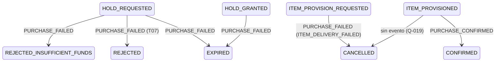

# Contrato de avisos de compra

> Qué eventos publica Mercado para que Notificaciones avise al alumno: el resultado de una compra directa (`PURCHASE_CONFIRMED` y `PURCHASE_FAILED`, historia #1051) y las ofertas nuevas o reactivadas de su curso (`CATALOG_OFFER_PUBLISHED` y `CATALOG_OFFER_REACTIVATED`, historia #1052). Es el entregable de las tareas #1054 y #1058 y está en borrador hasta que Notificaciones lo acepte.

## Alcance

- Cubre el final de la [[Saga]] de compra directa: reserva de monedas, entrega del ítem y confirmación del cobro ([[DEC-004 - Máquina de estados de la orden según el código]]).
- Cubre la publicación y la reactivación de ofertas del catálogo ([[DEC-018 - Aviso de ofertas nuevas]]). Las subastas no están cubiertas.
- Mercado publica **hechos**. Qué texto se muestra, por qué canal y cuándo lo decide Notificaciones ([[Integración con Notificaciones]]).
- El alumno se identifica solo por su `studentId`: ningún aviso lleva nombre, mail ni otro dato personal.

## Transporte

Vale para los cuatro eventos.

| Aspecto | Valor | Fuente |
|---|---|---|
| Tópico | `market.events` (DLT `market.events.DLT`) | [[DEC-008 - Nombre de productor y tópicos de Mercado]] |
| Key del mensaje | `studentId` en los avisos de compra; `courseId` en los de ofertas | Mantiene en orden los avisos de un mismo alumno o de un mismo curso |
| `producer` | `market-service` | [[DEC-008 - Nombre de productor y tópicos de Mercado]] |
| Envelope | Los 6 campos de la plataforma: `eventId`, `eventType`, `eventVersion`, `timestamp`, `producer`, `payload` | [[Eventos y Kafka]] |
| `eventVersion` | `1` | Notificaciones descarta cualquier otra versión |
| Formato | JSON plano, campos en `camelCase`, fechas ISO-8601 UTC | Notificaciones acepta `camelCase` en `market.events` |
| Entrega | Al menos una vez (*at-least-once*): un mismo evento puede llegar repetido con el **mismo** `eventId` | [[Patrón Outbox]] |

Cada evento se escribe en el outbox dentro de la misma transacción que el cambio que lo origina (el cierre de la orden o la activación de la oferta). Si Kafka no responde, la compra queda cerrada o la oferta queda publicada igual, y el relay reintenta el envío con el mismo `eventId`.

## Cuándo se publica cada evento de compra

Cada orden emite **un solo** evento de resultado, al llegar a su estado final.

| Estado final de la orden | Evento | `reason` |
|---|---|---|
| `CONFIRMED` | `PURCHASE_CONFIRMED` | — |
| `REJECTED_INSUFFICIENT_FUNDS` (Accounting rechaza la reserva con `INSUFFICIENT_BALANCE`) | `PURCHASE_FAILED` | `INSUFFICIENT_FUNDS` |
| `REJECTED` con `rejectionReason` `ACCOUNT_NOT_FOUND` o `ACCOUNT_INACTIVE` | `PURCHASE_FAILED` | `ACCOUNT_UNAVAILABLE` |
| `REJECTED` con `rejectionReason` `LIFE_CAP_REACHED` (Accounting rechaza con `MAX_LIVES_REACHED`) | `PURCHASE_FAILED` | `LIFE_CAP_REACHED` |
| `REJECTED` con cualquier otro de los motivos de [[DEC-009 - Contrato de holds e ítems según Accounting]] | `PURCHASE_FAILED` | `PROCESSING_ERROR` |
| `EXPIRED` (la reserva venció antes de terminar) | `PURCHASE_FAILED` | `RESERVATION_EXPIRED` |
| `CANCELLED` con motivo `ITEM_PROVISION_FAILED` (el disparador depende de [[Q-008 - Orden de la saga de compra]]) | `PURCHASE_FAILED` | `ITEM_DELIVERY_FAILED` |
| `CANCELLED` con motivo `HOLD_NOT_SETTLED` (ítem entregado, cobro no realizado) | **No se publica** hasta resolver [[Q-019 - Aviso cuando el ítem se entregó sin cobro]] | — |

El estado `REJECTED` y el campo `rejectionReason` los agrega la tarea T07 de #5193 (rama `feature/us-5193-t07-accounting-rejection-reasons`, sin mergear el 2026-10-05). Mientras no entre, todo rechazo de Accounting termina en `REJECTED_INSUFFICIENT_FUNDS`.

Cuando Mercado rechaza la compra de vidas **antes** del hold, por superar el tope, responde 422 `LIFE_CAP_REACHED` sin crear la orden ([[DEC-007 - Tope de vidas, Accounting decide y reporta]]). El alumno ve el error en la pantalla de compra y no se publica ningún aviso. El motivo `LIFE_CAP_REACHED` de `PURCHASE_FAILED` cubre el caso en que Accounting rechaza la reserva por el tope de todas formas.



## `PURCHASE_CONFIRMED` (versión 1)

La compra terminó bien: se cobraron las monedas y el ítem quedó en el inventario del alumno.

| Campo | Tipo | Obligatorio | Descripción |
|---|---|---|---|
| `orderId` | string (UUID) | Sí | `orderRef` de la orden: el mismo `orderId` que Mercado usa con Accounting en el bus (`OrderEntity.bankOrderId()`). No es el id numérico de la API REST |
| `studentId` | string (UUID) | Sí | Alumno que compró; es el único destinatario del aviso |
| `courseId` | string | Sí | Curso donde se hizo la compra |
| `offerId` | string | Sí | Oferta del catálogo que se compró |
| `offerName` | string | Sí | Nombre de la oferta al momento de la compra (copiado en la orden al crearla) |
| `itemType` | string | Sí | `SHIELD`, `BOOST_XP`, `BOOST_COINS` o `LIFE` |
| `quantity` | integer | Sí | Unidades compradas: las vidas que otorga la oferta si `itemType` es `LIFE`, y `1` en los demás casos |
| `amount` | integer | Sí | Monedas cobradas: el precio aplicado a la orden (`appliedPrice`), que coincide con el `amount` de `HOLD_CONFIRMED` |
| `holdId` | string | No | Reserva de Accounting que se confirmó; solo sirve para trazabilidad y Notificaciones puede ignorarlo |
| `confirmedAt` | string (ISO-8601 UTC) | Sí | Momento en que la orden quedó confirmada |

```json
{
  "eventId": "8b1f2c4e-6d0a-4c43-9b8e-2f6a1d7e9c10",
  "eventType": "PURCHASE_CONFIRMED",
  "eventVersion": 1,
  "timestamp": "2026-10-04T15:30:00Z",
  "producer": "market-service",
  "payload": {
    "orderId": "6f1c2e8a-9b3d-4a57-8e21-0c4d5f6a7b8c",
    "studentId": "3fa85f64-5717-4562-b3fc-2c963f66afa6",
    "courseId": "COURSE_PROG4_2026",
    "offerId": "7",
    "offerName": "Escudo anti-error",
    "itemType": "SHIELD",
    "quantity": 1,
    "amount": 120,
    "holdId": "4d2b7a90-1c3e-4f5a-8b6d-0e9f1a2b3c4d",
    "confirmedAt": "2026-10-04T15:30:00Z"
  }
}
```

## `PURCHASE_FAILED` (versión 1)

La compra no se completó. En todos los casos de este evento **no se cobró nada** y la reserva de monedas se liberó o vence sola en Accounting.

| Campo | Tipo | Obligatorio | Descripción |
|---|---|---|---|
| `orderId` | string (UUID) | Sí | `orderRef` de la orden: el mismo `orderId` que Mercado usa con Accounting en el bus. No es el id numérico de la API REST |
| `studentId` | string (UUID) | Sí | Alumno que intentó comprar; único destinatario del aviso |
| `courseId` | string | Sí | Curso donde se intentó la compra |
| `offerId` | string | Sí | Oferta del catálogo |
| `offerName` | string | Sí | Nombre de la oferta al momento del intento |
| `itemType` | string | Sí | `SHIELD`, `BOOST_XP`, `BOOST_COINS` o `LIFE` |
| `quantity` | integer | Sí | Unidades que se intentaron comprar, con la misma regla que en `PURCHASE_CONFIRMED` |
| `reason` | string | Sí | Motivo normalizado (tabla siguiente) |
| `failedAt` | string (ISO-8601 UTC) | Sí | Momento en que la orden llegó a su estado final |

| `reason` | Qué le pasó al alumno |
|---|---|
| `INSUFFICIENT_FUNDS` | No tenía monedas suficientes |
| `ACCOUNT_UNAVAILABLE` | Su cuenta en el curso no existe o está inactiva |
| `LIFE_CAP_REACHED` | Ya tiene el máximo de vidas permitido y no puede comprar más |
| `RESERVATION_EXPIRED` | La compra tardó demasiado y la reserva venció |
| `ITEM_DELIVERY_FAILED` | No se pudo entregar el ítem; las monedas reservadas se devolvieron |
| `PROCESSING_ERROR` | Error técnico al procesar la compra |

Los seis motivos son parte del contrato y Notificaciones tiene que manejarlos todos. Si en una versión futura se agrega un motivo, un consumidor que reciba un `reason` desconocido debe tratarlo como `PROCESSING_ERROR`.

```json
{
  "eventId": "c2a9e7d1-5b44-4f0e-a1c3-7d8e9f0a1b2c",
  "eventType": "PURCHASE_FAILED",
  "eventVersion": 1,
  "timestamp": "2026-10-04T15:30:05Z",
  "producer": "market-service",
  "payload": {
    "orderId": "a3e5c7d9-1b2f-4c6e-9a8b-7d6c5e4f3a21",
    "studentId": "3fa85f64-5717-4562-b3fc-2c963f66afa6",
    "courseId": "COURSE_PROG4_2026",
    "offerId": "7",
    "offerName": "Escudo anti-error",
    "itemType": "SHIELD",
    "quantity": 1,
    "reason": "INSUFFICIENT_FUNDS",
    "failedAt": "2026-10-04T15:30:05Z"
  }
}
```

## Casos de compra fuera de la versión 1

| Caso | Por qué queda afuera | Dónde se sigue |
|---|---|---|
| Ítem entregado y cobro no realizado (`CANCELLED(HOLD_NOT_SETTLED)`) | Es una anomalía de revisión manual | [[Q-019 - Aviso cuando el ítem se entregó sin cobro]] |
| Vida cobrada y no acreditada (`LIFE_PURCHASE_REJECTED` de Accounting) | Mercado ya lo maneja (PR #96 de `tpi-market`): la orden sigue `CONFIRMED`, se marca `SETTLED_UNCREDITED` y queda una alerta de auditoría para que un administrador pida la devolución desde BackOffice. Para entonces el alumno ya recibió `PURCHASE_CONFIRMED`. Es un caso de revisión manual, con el mismo criterio que Q-019, y Accounting todavía no publica el evento | [[DEC-007 - Tope de vidas, Accounting decide y reporta]], [[Integración con Accounting]] |

## Otros eventos de la misma compra

Una compra confirmada también genera `ITEM_CONFIRMED` o `LIFE_PURCHASE_CONFIRMED`, dirigidos a Accounting y a Roadmap para acreditar el ítem o las vidas ([[DEC-009 - Contrato de holds e ítems según Accounting]]). **No son avisos para el alumno**: Notificaciones debe avisar solo con `PURCHASE_CONFIRMED` y `PURCHASE_FAILED`, para que una compra no genere dos avisos.

## `CATALOG_OFFER_PUBLISHED` y `CATALOG_OFFER_REACTIVATED` (versión 1)

Hay una oferta nueva, o una que estaba pausada volvió a estar disponible, en el mercado de un curso ([[DEC-018 - Aviso de ofertas nuevas]]). Los dos eventos llevan el mismo payload; el nombre del evento indica el hecho.

| Hecho | Evento |
|---|---|
| Un profesor crea una oferta (queda activa al crearse: no hay borrador) | `CATALOG_OFFER_PUBLISHED` |
| Un profesor pasa una oferta de pausada (`active = false`) a activa | `CATALOG_OFFER_REACTIVATED` |
| Un ADMIN, GESTOR o servicio con `MS` crea o activa una oferta, por cualquier ruta | Ninguno |
| Cambio de precio, stock, nombre o descripción de una oferta activa | Ninguno |
| Pausar una oferta, o reenviar el mismo estado | Ninguno |
| Activar una oferta vencida por fecha | Ninguno: una oferta vencida no se reactiva; el profesor publica una nueva |

El criterio es quién actúa: avisa un usuario con rol `PROFESSOR`, aunque tenga otros roles.

| Campo | Tipo | Obligatorio | Descripción |
|---|---|---|---|
| `offerId` | string | Sí | Oferta del catálogo |
| `courseId` | string | Sí | Curso de la oferta. Es el destinatario: Notificaciones avisa a los alumnos activos de ese curso, que resuelve con Cursos |
| `templateId` | string | Sí | Plantilla base del ítem |
| `offerName` | string | Sí | Nombre de la oferta (`customName`) |
| `itemType` | string | Sí | `SHIELD`, `BOOST_XP`, `BOOST_COINS` o `LIFE` |
| `price` | integer | Sí | Precio en monedas (`coinPrice`) |
| `publishedAt` | string (ISO-8601 UTC) | Sí | Momento en que la oferta quedó disponible: su creación o su reactivación |

El aviso no informa stock ([[DEC-018 - Aviso de ofertas nuevas]]).

```json
{
  "eventId": "5e7a9c1b-3d2f-4a6e-8b0c-1f2e3d4c5b6a",
  "eventType": "CATALOG_OFFER_PUBLISHED",
  "eventVersion": 1,
  "timestamp": "2026-10-05T13:00:00Z",
  "producer": "market-service",
  "payload": {
    "offerId": "12",
    "courseId": "COURSE_PROG4_2026",
    "templateId": "TPL_SHIELD_BASIC",
    "offerName": "Escudo anti-error",
    "itemType": "SHIELD",
    "price": 120,
    "publishedAt": "2026-10-05T13:00:00Z"
  }
}
```

Un aviso de oferta nunca lleva lista de alumnos: Notificaciones resuelve los destinatarios por `courseId` al recibirlo, y ningún alumno de otro curso debe recibirlo.

## Dependencias con el contrato de Accounting (#5193)

Estado el 2026-10-05 (`develop` en `9b4c05f9`):

| Tarea de #5193 | Qué resuelve para este contrato | Estado |
|---|---|---|
| T01 (PR #88) | Crea `orderRef` (UUID) en la orden; es el valor de `orderId` en los avisos de compra | Mergeada |
| T02 (PR #88) | Mueve `PURCHASE_CONFIRMED` a `market.events` | Mergeada |
| T04 (PR #102) | Cambia el productor a `market-service` | Mergeada |
| T05 y T06 | Reemplazan la entrega del ítem por `ITEM_CONFIRMED` → `ITEM_CREDITED`; con T06 la orden pasa a `CONFIRMED` al recibir `ITEM_CREDITED`. Accounting no publica una falla de entrega, así que el disparador de `ITEM_DELIVERY_FAILED` depende de [[Q-008 - Orden de la saga de compra]] | Pendientes |
| T07 | Agrega el estado `REJECTED` y guarda en la orden cada uno de los 10 motivos de rechazo de Accounting. Los motivos de `PURCHASE_FAILED` se derivan de ese mapeo | En rama, sin mergear |

## Criterios acordados

Refinados con el equipo de Mercado el 2026-10-04 y el 2026-10-05, antes de enviar el contrato:

| Tema | Criterio | Motivo |
|---|---|---|
| Ítem entregado sin cobro | No se avisa; queda como revisión manual | Postura provisoria hasta que producto resuelva [[Q-019 - Aviso cuando el ítem se entregó sin cobro]] |
| Motivos de falla | Los 6 motivos normalizados, no los códigos de Accounting | Alcanzan para un aviso claro y no atan a Notificaciones con el contrato de Accounting |
| Tope de vidas | `LIFE_CAP_REACHED` es un motivo obligatorio del contrato, no opcional | El alumno tiene que entender que no fue falta de monedas ni un error técnico |
| Precio en la compra fallida | No se incluye | No se cobró nada; el aviso no lo necesita |
| `producer` | `market-service` | [[DEC-008 - Nombre de productor y tópicos de Mercado]] |
| `offerName` y `quantity` | Se copian en la orden al crearla | El profesor puede editar la oferta después de la compra |
| Tipos de `orderId` y `offerId` | string | Preparado para el `orderRef` UUID de [[DEC-009 - Contrato de holds e ítems según Accounting]] |
| `holdId` | Opcional en `PURCHASE_CONFIRMED` | Trazabilidad; Notificaciones lo ignora |
| Key del mensaje | `studentId` en compras, `courseId` en ofertas | Mantiene en orden los avisos de un mismo destinatario |
| Destino del aviso | No se sugiere | Es decisión de Notificaciones y del frontend |
| Comunicación | La envía el líder de Mercado | El contrato involucra una decisión del líder (DEC-008) |
| `orderId` | `orderRef` UUID | Es el id que comparten todos los eventos de la compra en el bus (PR #88) |
| `LIFE_PURCHASE_REJECTED` | Fuera de la versión 1; queda como revisión manual | El alumno ya recibió `PURCHASE_CONFIRMED` y la devolución la hace un administrador |
| `ITEM_DELIVERY_FAILED` | Se mantiene, sujeto a [[Q-008 - Orden de la saga de compra]] | Existe en el código actual; con #5193 su disparador puede cambiar |
| Avisos de ofertas | Dos eventos, destinatario `courseId`, solo avisa un profesor, sin reactivar vencidas | [[DEC-018 - Aviso de ofertas nuevas]] |

## Qué se espera de Notificaciones

- Agregar `PURCHASE_CONFIRMED`, `PURCHASE_FAILED`, `CATALOG_OFFER_PUBLISHED` y `CATALOG_OFFER_REACTIVATED` a lo que acepta su consumidor de `market.events`. Hoy acepta solo `TRADE_ITEM_PUBLISHED` y `AUCTION_STARTED` y descarta el resto sin registrarlo.
- Avisos de compra: tratarlos con **un solo destinatario** (`studentId`), no con la lista `student_user_ids`.
- Avisos de ofertas: resolver los alumnos activos del curso a partir de `courseId`, en lugar de exigir `student_user_ids` (regla BR-01).
- Descartar repetidos por `eventId`, como ya hace con `ProcessedEvent`. Con eso se cumple que el alumno reciba un solo aviso (escenario 3 de #1051 y de #1052).
- Manejar los seis motivos de `PURCHASE_FAILED`, ignorar los campos que no use y tratar un `reason` desconocido como error genérico.
- Definir el texto, el `notification_type` y la ruta de destino de cada aviso.

## Diferencias con el código actual

Hoy (`develop` en `9b4c05f9`) el código no cumple este contrato. Las tareas #1055 (T02) y #1056 (T03) cierran la brecha de compras, y #1059 (T02) y #1060 (T03) la de ofertas.

| Tema | Hoy en el código | Según este contrato |
|---|---|---|
| Ids y monto | `PURCHASE_CONFIRMED` lleva el `orderId` numérico interno, `offerId` numérico y `amount` decimal tomado de la respuesta de Accounting (`dtos/events/PurchaseConfirmedPayloadDto.java`) | `orderId` = `orderRef` UUID (`OrderEntity.bankOrderId()`), `offerId` string y `amount` entero tomado de `appliedPrice` |
| Nombre, tipo y cantidad del ítem | `PURCHASE_CONFIRMED` no los lleva. La orden guarda `itemType`, pero no el nombre de la oferta ni las vidas que otorga (`entities/OrderEntity.java`) | `offerName`, `itemType` y `quantity` en el evento; `offerName` y `quantity` copiados en la orden al crearla (requiere migración) |
| Compra fallida | No se publica nada: `services/impl/OrderHoldServiceImpl.java` y `services/impl/OrderItemProvisionServiceImpl.java` solo cambian el estado | `PURCHASE_FAILED` |
| Motivo del rechazo | Cualquier rechazo de Accounting termina en `REJECTED_INSUFFICIENT_FUNDS` (`OrderHoldServiceImpl.applyRejection`) | Mapear `ACCOUNT_UNAVAILABLE`, `LIFE_CAP_REACHED` y `PROCESSING_ERROR` aparte, a partir de #5193 T07 |
| Ofertas | No se publica ningún evento al crear ni al activar una oferta (`services/impl/CourseCatalogManageServiceImpl.java`) | `CATALOG_OFFER_PUBLISHED` y `CATALOG_OFFER_REACTIVATED` |
| Ofertas vencidas | `updateOfferStatus` y `updateOfferStatusForCourse` dejan activar una oferta vencida; solo `updateOffer` lo impide (`validateReactivation`) | Ninguna ruta reactiva una oferta vencida. Agregar la validación queda fuera de #1052; hasta entonces no se avisa |
| Reenvío del relay | Si un envío falla, el relay corta la pasada y esa fila frena a las siguientes (`services/impl/OutboxRelayServiceImpl.java`) | Sin cambio en este contrato; lo trata [[S2-05 - Robustez de la compra]] |

## Acuerdos pendientes

- **Notificaciones:** aceptar el contrato, implementar el consumo de los cuatro eventos, resolver los alumnos de un curso con Cursos y confirmar que el `studentId` que reciben de la plataforma es siempre un UUID (Mercado lo toma del header `X-User-Id` sin validarlo).
- **Producto:** [[Q-019 - Aviso cuando el ítem se entregó sin cobro]].
- **Contrato con Accounting (#5193):** coordinar con quien tome T07 el mapeo de motivos, y con T06 que `PURCHASE_CONFIRMED` se publique al pasar a `CONFIRMED`, sea cual sea el evento que lo dispare.

## Relacionado

[[Integración con Notificaciones]], [[DEC-018 - Aviso de ofertas nuevas]], [[Eventos y Kafka]], [[DEC-008 - Nombre de productor y tópicos de Mercado]], [[DEC-009 - Contrato de holds e ítems según Accounting]], [[Revisión del Sprint 2 en Taiga]].
