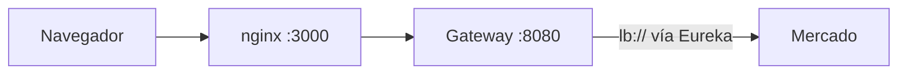

# Gateway e identidad

> Cómo llegan las peticiones a Mercado: el gateway valida el JWT y entrega la identidad como cabeceras; Mercado confía en ellas porque su puerto no está publicado. Cómo se leen los roles lo fija [[DEC-006 - Roles y permisos según el código y los headers del gateway]] (enmendada por [[Q-020 - Roles desconocidos y prefijo ROLE_ en la identidad]]); qué puede hacer un servicio con `MS` en las rutas de estado de oferta lo fija [[DEC-017 - Servicios con MS en las rutas de estado de oferta]].

## Camino de una petición

Verificado contra el gateway y el compose de la plataforma:

1. nginx (`:3000`, timeout de 30 s) recibe la petición y la pasa al gateway.
2. El gateway (`:8080`, timeout de 25 s) valida el JWT con JWKS y consulta la sesión en Redis.
3. Elimina las cabeceras `X-*` reservadas y reinyecta `X-User-Id`, `X-User-Roles` y `X-Principal-Type` (y las de servicio).
4. Enruta con `lb://` vía Eureka al microservicio.

Las llamadas **de microservicio a microservicio también pasan por el gateway**, con un token de servicio (`aud` y rol `MS`). Cada microservicio tiene su propia red; no existe una red compartida entre ellos. Una ruta fuera de `GATEWAY_ALLOWLIST` responde 404.

## Cómo funciona el gateway

`tpi-api-gateway` es un Spring Cloud Gateway (WebFlux) en el puerto 8080 (gestión 8081), alcanzable solo desde nginx por la red `tpi-edge`.

- Valida el JWT contra `JWKS_URI=http://users-service:8082/.well-known/jwks.json` con emisor `users-service`.
- `AllowlistRouteLocator` crea la ruta `Path=/api/{name}/**` por cada servicio permitido (`name` es el id del servicio sin `-service`), con `lb://` vía Eureka. Para Mercado resulta `/api/market/**`, coherente con el código ([[DEC-005 - Endpoints y prefijos según el código]]); para Accounting, `/api/accounting/**`.
- `GATEWAY_ALLOWLIST` vale por defecto `users-service`; el compose lo sobrescribe y, según el `platform.env` generado upstream, incluye a `market-service` ([[Q-016 - Puerto y registro de Mercado en la plataforma]]).
- `IdentityPropagationFilter` elimina las cinco cabeceras reservadas y las reinyecta desde el JWT.
- Extras: circuit breaker por ruta, bulkhead de 64, reintento solo para GET, invalidación de sesión con Redis y limitación de tasa. La lista de Swagger del gateway omite a Mercado.

## Las cinco cabeceras de identidad

| Cabecera | Contenido |
|---|---|
| `X-Principal-Type` | `user` o `service` |
| `X-User-Id` | Identificador del usuario |
| `X-User-Roles` | Roles del usuario |
| `X-Service-Id` | Identificador del servicio llamador |
| `X-Service-Scopes` | Ámbitos (scopes) del servicio |

El token de la persona viaja en la cookie `fu_at`; el token de servicio, en `Authorization`, y el micro no lo valida.

## Cómo las recibe Mercado

`GatewayIdentityFilter` (`src/main/java/ar/edu/utn/frc/tup/p4/configs/filters/GatewayIdentityFilter.java`) arma la autenticación solo con esas cabeceras, sin validar JWT. Para usuarios: `X-Principal-Type=user`, `X-User-Id` y cada rol de `X-User-Roles` como `ROLE_<rol>`. Para servicios: `X-Service-Id` y `X-Service-Scopes`; el ámbito `MS` se convierte en `ROLE_MS`, los ámbitos que empiezan con `ROLE_` se descartan y el resto queda como autoridad simple. Se vuelve a ejecutar en el despacho asíncrono (necesario para [[SSE]]). Roles: STUDENT, PROFESSOR, ADMIN, GESTOR, MS.

**La cabecera `X-Roles`.** Mercado ya no la lee. El filtro la dejó con el change `gateway-mesh-integration`, y hasta `codigo@276af52` cuatro controladores todavía la usaban como respaldo cuando faltaba `X-User-Roles` (`CourseCatalogManageController`, `CatalogOfferController`, `StorefrontCatalogController` y `CourseCatalogSummaryController`, dos de ellos con valor por defecto `ROLE_STUDENT`); el PR #86 la quitó de todos. Ningún cliente la envía: el gateway la elimina y el frontend no la usa.

**Lectura de roles desde el PR #86** (T01 de [[S2-04 - Seguridad]], mergeado en `develop` el 2026-10-03 (`3e2b88b`, aprobado por Patinio)). `models/enums/UserRole` es el único lector de `X-User-Roles` para el filtro y para los services: compara cada rol exacto y con mayúsculas, saca un solo `ROLE_` inicial y descarta lo que no sea uno de los cinco roles. Antes el filtro prefijaba sin condiciones (`ROLE_PROFESSOR` daba `ROLE_ROLE_PROFESSOR`) y convertía cualquier texto en autoridad. Esta conducta es la regla desde la enmienda de DEC-006 del 2026-10-04 ([[Q-020 - Roles desconocidos y prefijo ROLE_ en la identidad]]).

## Autorización en dos capas

1. `@PreAuthorize` por endpoint (por ejemplo `hasRole('MS') and hasAuthority('market.catalog.read')`).
2. Regla de negocio: inscripción del estudiante o asignación del profesor, con los clientes de [[Integración con Cursos]]. Desde el 2026-10-08 las decisiones piden que esta capa use la membresía de Cursos: el mercado del curso tiene que estar habilitado ([[DEC-020 - Mercado habilitado solo con la cohorte ACTIVE]]) y solo entran `STUDENT` validado y `PROFESSOR` / `PROFESSOR_READ_ONLY`, sin `GESTOR` ([[DEC-021 - Acceso al mercado por membresía de Cursos]]). Hoy el código todavía usa los clientes simulados o provisorios.

Las dos capas no leen igual la identidad: la primera usa las autoridades del filtro y la segunda la cadena de `X-User-Roles`. Hasta `codigo@276af52`, por eso, un servicio con ámbito `MS` pasaba la primera y la segunda lo trataba como si no tuviera roles: `PATCH /offers/{id}/status` lo rechazaba y la ruta de estado del curso lo dejaba pasar sin chequeo.

**Desde el PR #92 de `tpi-market`** (T02 de [[S2-04 - Seguridad]], mergeado en `develop` el 2026-10-04 (`76a9bbd`, aprobado por tommikimmel)), las dos rutas de estado de oferta leen el principal autenticado (`Authentication`, roles con `UserRole.fromAuthorities`) en lugar de las cabeceras, así que un servicio con `MS` es administrativo en ambas; ningún chequeo de rol se saltea con la cabecera vacía, y el filtro descarta los ámbitos de servicio con forma de rol. Lo registra [[DEC-017 - Servicios con MS en las rutas de estado de oferta]]; las demás rutas siguen leyendo `X-User-Roles`.

## Puntos débiles

- Si el puerto de Mercado se publicara, cualquiera podría falsificar cabeceras.
- Hasta el PR #86 algunos servicios leían el rol con `contains()`, así que un valor como `PROFESSOR, SYSTEMS` contaba como `MS`; eso ya está corregido en `develop`. El chequeo de profesor que se omitía con cabecera vacía lo cerró el PR #92 (T02); el usuario por defecto `usr-student-001` lo quitó el PR #93 (T03 de [[S2-04 - Seguridad]], mergeado en `develop` el 2026-10-06 (`011fe7d6`, aprobado y mergeado por Lucio Wiesek)): sin `X-User-Id`, las lecturas responden 400 `missing-header`, con la cabecera vacía los detalles de la vitrina responden 403, y un usuario sigue recibiendo 401 del filtro ([[DEC-006 - Roles y permisos según el código y los headers del gateway]] fija el modelo de roles; ver [[Estado actual del código]]).
- Hasta el PR #92, un servicio cuyo `X-Service-Scopes` trajera un valor con forma de rol (`ROLE_ADMIN`) recibía esa autoridad tal cual; desde ese PR el filtro descarta esos ámbitos ([[DEC-017 - Servicios con MS en las rutas de estado de oferta]]).
- `JwksRefreshJob` consulta el JWKS cada 5 minutos solo como canario (`/jwks-status`).
- El timeout del gateway (25 s) es menor que el de nginx (30 s); las peticiones largas se cortan primero en el gateway.

Ver [[Mapa de servicios]], [[Integración con Users]] e [[Integración con Accounting]].
