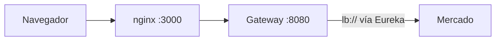

# Gateway e identidad

> Cómo llegan las peticiones a Mercado: el gateway valida el JWT y entrega la identidad como cabeceras; Mercado confía en ellas porque su puerto no está publicado.

## Camino de una petición

Verificado contra el gateway y el compose de la plataforma:

1. nginx (`:3000`, timeout de 30 s) recibe la petición y la pasa al gateway.
2. El gateway (`:8080`, timeout de 25 s) valida el JWT con JWKS y consulta la sesión en Redis.
3. Elimina las cabeceras `X-*` reservadas y reinyecta `X-User-Id`, `X-User-Roles` y `X-Principal-Type` (y las de servicio).
4. Enruta con `lb://` vía Eureka al microservicio.

Las llamadas **de microservicio a microservicio también pasan por el gateway**, con un token de servicio (`aud` y rol `MS`). Cada microservicio tiene su propia red; no existe una red compartida entre ellos. Una ruta fuera de `GATEWAY_ALLOWLIST` responde 404.

## Cómo funciona el gateway

`tpi-api-gateway` es un Spring Cloud Gateway (WebFlux) en el puerto 8080 (gestión 8081), alcanzable solo desde nginx por la red `tpi-edge`.

- Valida el JWT contra `JWKS_URI=http://users-service:8082/.well-known/jwks.json` con emisor `users-service`.
- `AllowlistRouteLocator` crea la ruta `Path=/api/{name}/**` por cada servicio permitido (`name` es el id del servicio sin `-service`), con `lb://` vía Eureka. Para Mercado resulta `/api/market/**`, coherente con el código ([[DEC-005 - Endpoints y prefijos según el código]]); para Accounting, `/api/accounting/**`.
- `GATEWAY_ALLOWLIST` vale por defecto `users-service`; el compose lo sobrescribe y, según el `platform.env` generado upstream, incluye a `market-service` ([[Q-016 - Puerto y registro de Mercado en la plataforma]]).
- `IdentityPropagationFilter` elimina las cinco cabeceras reservadas y las reinyecta desde el JWT.
- Extras: circuit breaker por ruta, bulkhead de 64, reintento solo para GET, invalidación de sesión con Redis y limitación de tasa. La lista de Swagger del gateway omite a Mercado.

## Las cinco cabeceras de identidad

| Cabecera | Contenido |
|---|---|
| `X-Principal-Type` | `user` o `service` |
| `X-User-Id` | Identificador del usuario |
| `X-User-Roles` | Roles del usuario |
| `X-Service-Id` | Identificador del servicio llamador |
| `X-Service-Scopes` | Ámbitos (scopes) del servicio |

El token de la persona viaja en la cookie `fu_at`; el token de servicio, en `Authorization`, y el micro no lo valida.

## Cómo las recibe Mercado

`GatewayIdentityFilter` (`src/main/java/ar/edu/utn/frc/tup/p4/configs/filters/GatewayIdentityFilter.java`) arma la autenticación solo con esas cabeceras, sin validar JWT. Para usuarios: `X-Principal-Type=user`, `X-User-Id` y cada rol de `X-User-Roles` como `ROLE_<rol>`. Para servicios: `X-Service-Id` y `X-Service-Scopes`; el ámbito `MS` se convierte en `ROLE_MS` y el resto queda como autoridad simple. Existe un respaldo con la cabecera antigua `X-Roles`. Se vuelve a ejecutar en el despacho asíncrono (necesario para [[SSE]]). Roles: STUDENT, PROFESSOR, ADMIN, GESTOR, MS.

### Parseo de roles: PR #86 pendiente

Al 2026-10-03 lo anterior describe `develop` (`276af52`). La PR #86 de `tpi-market` (abierta, no mergeada) agrega `models/enums/UserRole.java` como único parser de `X-User-Roles` para el filtro y para los services: separa por comas, quita un solo `ROLE_` inicial y compara de forma exacta y con mayúsculas contra los cinco roles. Si se mergea, `X-User-Roles: ROLE_PROFESSOR` da `ROLE_PROFESSOR` (hoy da `ROLE_ROLE_PROFESSOR`), los roles desconocidos dejan de ser autoridades, `/whoami` deja de listarlos y desaparece el respaldo `X-Roles` de los controladores. Detalle y riesgos en [[Revisión de PRs abiertas (2026-10-03)]].

## Autorización en dos capas

1. `@PreAuthorize` por endpoint (por ejemplo `hasRole('MS') and hasAuthority('market.catalog.read')`).
2. Regla de negocio: inscripción del estudiante o asignación del profesor, con los clientes de [[Integración con Cursos]].

## Puntos débiles

- Si el puerto de Mercado se publicara, cualquiera podría falsificar cabeceras.
- Algunos servicios leen el rol con `contains()`; el chequeo de profesor se omite con cabecera vacía; hay usuario por defecto `usr-student-001` ([[DEC-006 - Roles y permisos según el código y los headers del gateway]] fija el modelo de roles; estos defectos siguen pendientes, [[Estado actual del código]]).
- `JwksRefreshJob` consulta el JWKS cada 5 minutos solo como canario (`/jwks-status`).
- El timeout del gateway (25 s) es menor que el de nginx (30 s); las peticiones largas se cortan primero en el gateway.

Ver [[Mapa de servicios]], [[Integración con Users]] e [[Integración con Accounting]].
